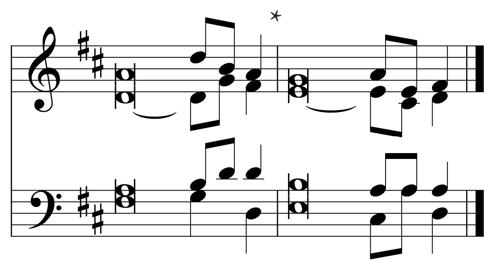
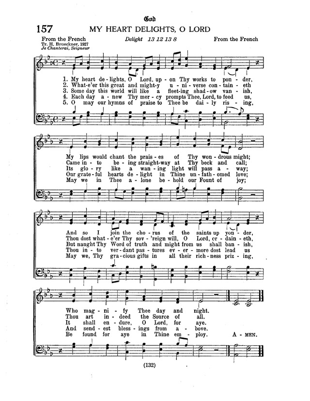

# Discrete Math and Programming

Discrete Math / Programming Repository for Homeschool Co-Op beginning Oct. 2023

## Opening

<table>

<tr>
<th>

### Psalmus 111 (Psalm 111)

</th>
<th>

  

</th>
</tr>
<tr>
<td>

_Ant: The works of the | LORD are great,*  
&nbsp;&nbsp;Sought out of all them that have pleas- | ure therein._  

Praise ye the LORD. I will praise the LORD with | my whole heart,*  
&nbsp;&nbsp;In the assembly of the upright, and in the con- | gregation.  

The works of the | LORD are great,*  
&nbsp;&nbsp;Sought out of all them that have pleas- | ure therein.  

His work is honourable and | glorious:*  
&nbsp;&nbsp;And his righteousness endureth | for ever.  

He hath made his wonderful works to be | remembered:*  
&nbsp;&nbsp;The LORD is gracious and full of | compassion.  

He hath given meat unto them | that fear him:*  
&nbsp;&nbsp;He will ever be mindful of his | covenant.  

</td>
<td>

He hath shewed his people the power | of his works,*  
&nbsp;&nbsp;That he may give them the heritage of | the heathen.  

The works of his hands are verity | and judgment;*  
&nbsp;&nbsp;All of his command- | ments are sure.  

They stand fast for ever | and ever,*  
&nbsp;&nbsp;And are done in truth and | uprightness.  

He sent redemption unto | his people:*  
&nbsp;&nbsp;He hath commanded his covenant for ever: Holy and reverend | is his name.  

The fear of the LORD is the beginning | of wisdom:*  
&nbsp;&nbsp;A good understanding have all they that do his commandments: His praise endureth | for ever.  

Glory be to the Father and | to the Son*   
&nbsp;&nbsp;and to the | Holy Ghost,  
as it was in the beginning,  
&nbsp;&nbsp;is now and e- | ver shall be,*  
&nbsp;&nbsp;world without end.  
&nbsp;&nbsp;A- | men, amen.  

_Ant: The works of the | LORD are great,*  
&nbsp;&nbsp;Sought out of all them that have pleas- | ure therein._  

</td>
</tr>
</table>

### Decalogus (The Ten Commandments)
#### Commandments
1. You shall have no other gods.
2. You shall not misuse the name of the LORD your God.
3. Remember the Sabbath day by keeping it holy.
4. Honor your father and your mother.
5. You shall not murder.
6. You shall not commit adultery.
7. You shall not steal.
8. You shall not give false testimony against your neighbor.
9. You shall not cover your neighbor's house.
10. You shall not cover your neighbor's wife, or his manservant or maidservant, his ox or donkey, or anything that belongs to your neighbor.
#### The Close of the Commandments
_What does God say about all these commandments?_  
He says, "I, the LORD your God, am a jealous God, punishing the children for the sin of the fathers to the third and fourth generations of those who hate Me, but showing love to a thousand generations of those who love Me and keep My commandments (Exodus 20:5-6)"

### Credo (Creed)
I believe in God, the Father Almighty, Maker of heaven and earth.  
And in Jesus Christ, His only Son, our Lord, who was conceived by the Holy Spirit, born of the Virgin Mary, suffered under Pontius Pilate, was crucified, died and was buried. He descended into hell. The third day he rose again from the dead. He ascended into heaven and sits at the right hand of God, the Father Almighty. From thence He will come to judge the living and the dead.  
I believe in the Holy Spirit, the holy Christian Church, the communion of saints, the forgiveness of sins, the resurrection of the body, and the life everlasting. Amen.  

### Pater noster (Our Father)
Our Father who art in heaven.  
Hallowed be Thy name.  
Thy kingdom come.  
Thy will be done on earth as it is in heaven.  
Give us this day our daily bread.  
And forgive us our trespasses as we forgive those who trespass against us.  
And lead us not into temptation.  
But deliver us from evil.  
(For Thine is the kingdom and the power and the glory forever and ever.) Amen  

### Hymnus (Hymn): My Heart Delights, O Lord

1. My heart delights, O Lord, upon Thy works to ponder,  
My lips would chant the praises of Thy wondrous might;  
And so I join the chorus of the saints up yonder,  
Who magnify Thee day and night.  
2. Whate'er this great and mighty universe containeth  
Came into being straightway at Thy beck and call;  
Thou dost whate'er Thy sov'reign will, O Lord, ordaineth.  
Thou art indeed the Source of all.  
3. Some day this world will like a fleeting shadow vanish,  
Its glory like a waning light will pass away;  
But naught Thy Word of truth and might from us shall banish,  
It shall endure, O Lord, for aye.  
4. Each day anew Thy mercy prompts Thee, Lord, to feed us,  
Our grateful hearts delight in Thine unfathomed love;  
Thou into verdant pastures evermore dost lead us  
And sendest blessings from above.  
5. O may our hymns of praise to Thee be daily rising,  
May we in Thee alone behold our Fount of joy;  
May we, Thy gracious gifts in all their richness prizing,  
Be found for aye in Thine employ.  
Amen.  

## Lesson

## Closing

  

### Gloria Patri

Glory be to the Father and | to the Son*   
&nbsp;&nbsp;and to the | Holy Ghost,  
as it was in the beginning,  
&nbsp;&nbsp;is now and e- | ver shall be,*  
&nbsp;&nbsp;world without end.  
&nbsp;&nbsp;A- | men, amen.  

### Antiphon

The works of the | LORD are great,*  
&nbsp;&nbsp;Sought out of all them that have pleas- | ure therein.  

### Benedictio (Benediction / Blessing)

The almighty and mer- | ciful Lord,*  
&nbsp;&nbsp;the Fa- | ther, the Son,  
and the | Holy Ghost*  
&nbsp;&nbsp;be with us all. A- | men, Amen.  

# Lesson plans

## Lesson 1

### Opening

#### Psalm 111

#### Ten Commandments

#### Creed

#### Lord's Prayer

#### Hymn: My Heart Delights, O Lord

### Game 1: Set

### Game 2: Intersection (Team)

### Game 3: Intersection (Individual)

### Closing

#### Gloria Patri

#### Antiphon

#### Benedictio
